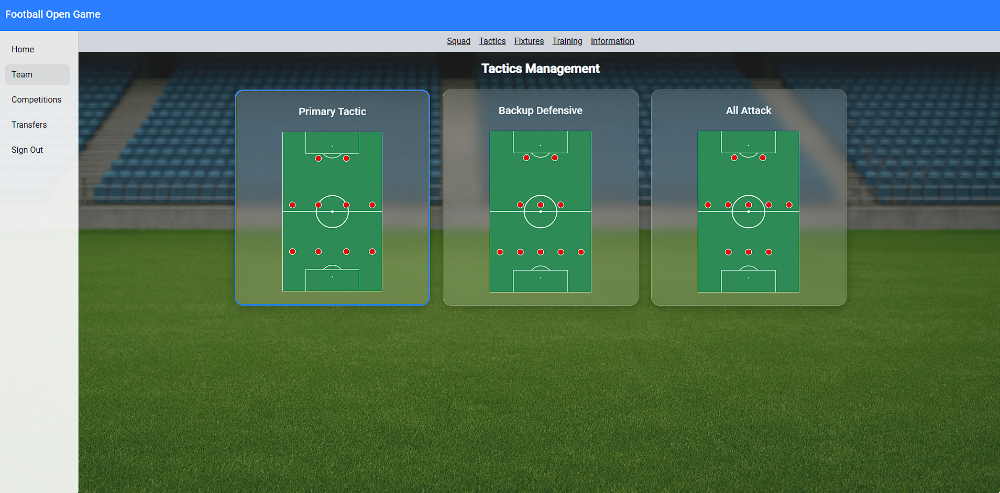
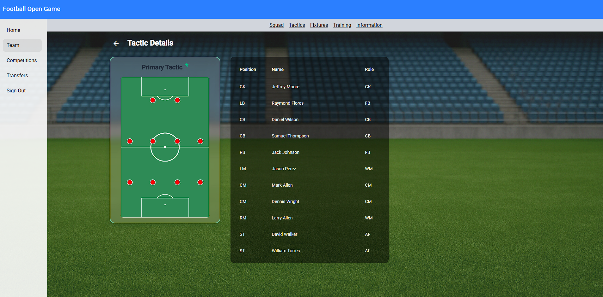
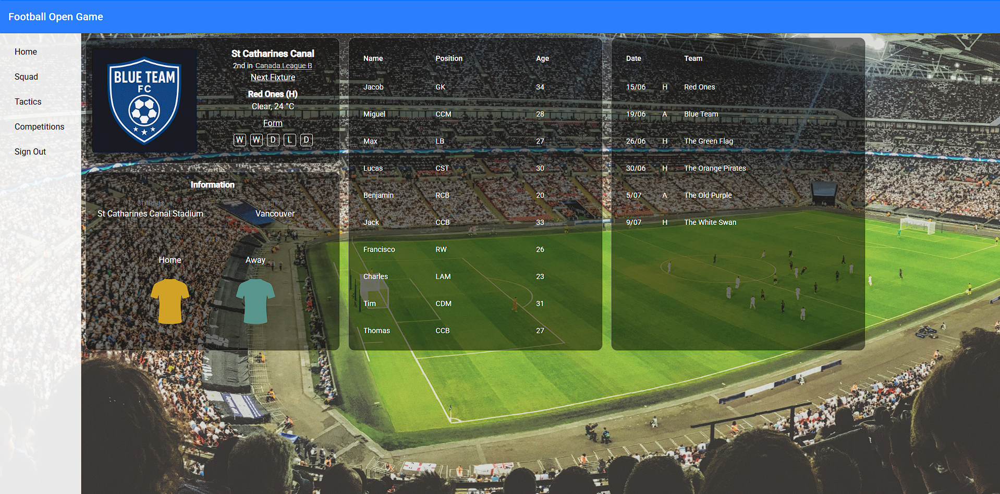

# FootballOpenFrontend ⚽

FootballOpenFrontend is a web application built with **Angular** that focuses on **football tactic and team management**.  
It provides a visual and interactive interface for setting up formations, adjusting tactical approaches, and managing team-related data.

This project was generated using [Angular CLI](https://github.com/angular/angular-cli) version 20.3.5.

---

## Project Overview

FootballOpenFrontend represents the **frontend part** of the Football Open project.  
Its main goal is to offer a clean and intuitive UI for managing football tactics and team configurations.

The application allows users to:
- Configure team formations  
- Adjust tactical setups  
- Manage team-related information  
- Interact with football data through a modern web interface  

---

## Backend Integration

This frontend can be used in combination with the **FootballOpenServer** backend:

🔗 https://github.com/tom-papaioannou/FootballOpenServer

The backend is built with **.NET** and provides:
- Data storage and retrieval  
- Tactical and team-related business logic  
- REST API endpoints consumed by this Angular application  

Running both projects together allows you to explore the **full scope of the Football Open project**, with a clear separation between frontend UI and backend logic.

---

## Screenshots

Below are some screenshots showcasing the application UI and its main features.


### Tactics Management



### Formation Setup



### Team Configuration



---

## Development Server

To start a local development server, run:

```bash
ng serve
```

Once the server is running, you can access the application in your browser at:

```
http://localhost:4200/
```

---

## License

This project is licensed under the **MIT License**.

Copyright (c) 2026 Tom Papaioannou

See the [LICENSE](LICENSE) file for more details.
